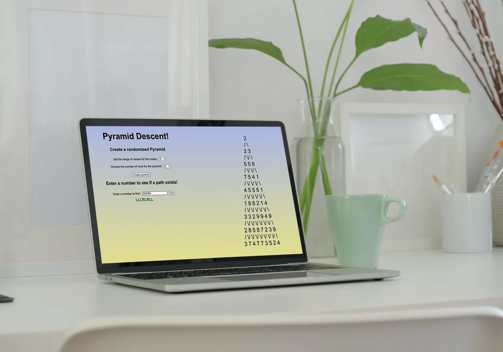

# Pyramid Descent

Pyramid Descent is a fun coding challenge turned into a little mini app.

## About The Project

The initial challenge was to write a function that solves a puzzle, to determine the correct path down a pyramid that results into the targeted value.

In addition, the pyramid isn't given, so one must create the pyramid itself. I decided to utilize a Binary Tree for such task, due to the nature of each node having a left and right child. The uniqueness of the Binary Tree, for a pyramid, is that a right child node might be the same as a left child node, thus resulting in the need to ensure a properly balanced pyramid.

Since making the function for the pyramid creation, I decided to go ahead and utilize the functions in a web application. This allows the user to make a randomized pyramid of their choosing, with a specific range of values and rows for the pyramid.



### Built With

* [React](https://reactjs.org/)
* [Express](https://expressjs.com/)
* [Node.js](https://nodejs.org/en/)

## Getting Started

### Prerequisites
* NPM

  ```bash
  npm install npm@latest -g
  ```

### Installation

Clone the Repo

  ```bash
  git clone https://github.com/aflatness/pyramidTraversalChallenge.git
  ```

Using NPM, install the required dependencies

  ```bash
  npm install
  ```


Run the following command

  ```bash
  npm run build
  ```

  ```bash
  npm start
  ```

And open up your browser to [localhost:3001](http://localhost:3001)


## Contributing
Pull requests are welcome. For major changes, please open an issue first to discuss what you would like to change.


## License
Distributed under the MIT License. [MIT](https://choosealicense.com/licenses/mit/)


## Contact

Alec Flatness - [@AFlatMajor4](https://twitter.com/AFlatMajor4) - aflatness@gmail.com

Project Link: [https://github.com/aflatness/pyramidTraversalChallenge](https://github.com/aflatness/pyramidTraversalChallenge)

